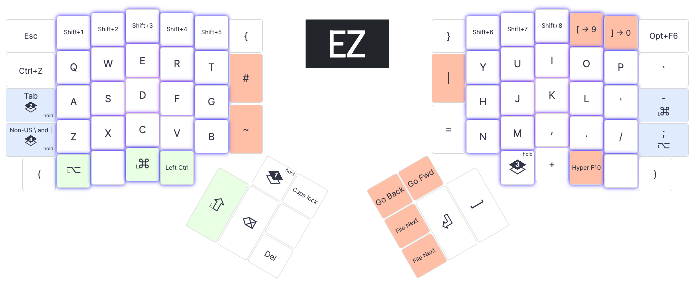
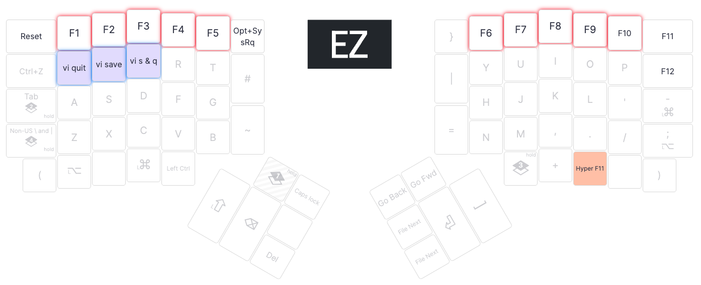
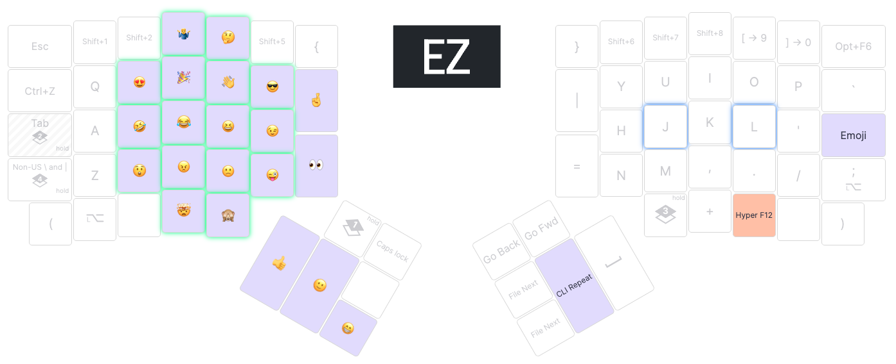
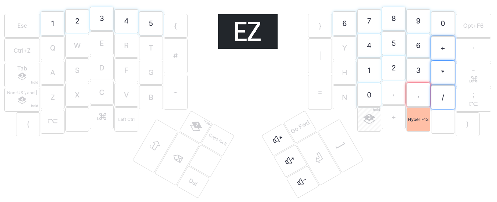
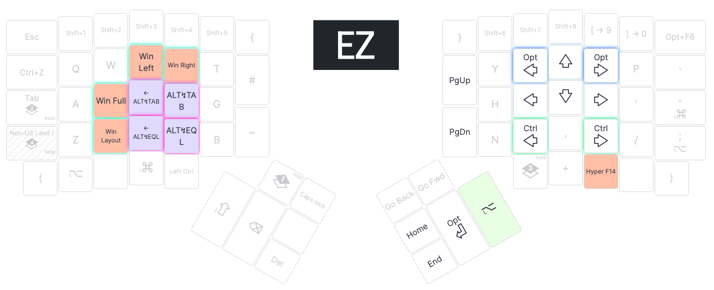
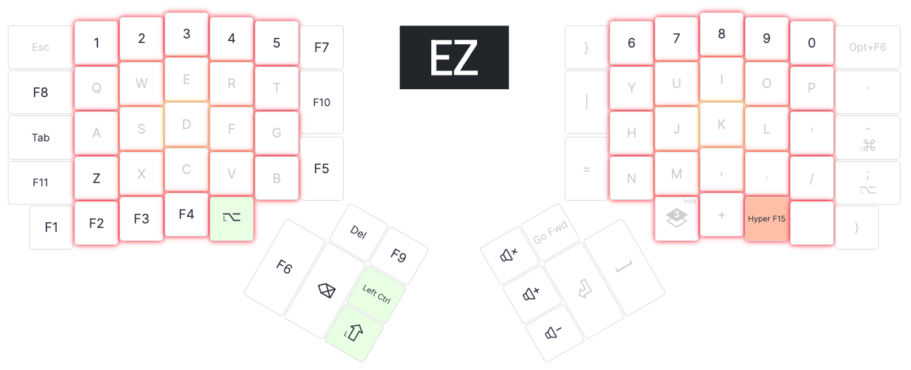

# @stoneman's Ergodox EZ layout

## Introduction

This repository is a fork of [qmk_userspace](https://github.com/qmk/qmk_userspace) containing my layout for the [Ergodox EZ](https://ergodox-ez.com/).

The source for my layout can be found within: [layouts/ergodox/stoneman/](layouts/ergodox/stoneman/)

## Building from source

- Check out this repo in [qmk_firmware](https://github.com/qmk/qmk_firmware).
- In your clone of this repo, update `QMK_USERSPACE` and `QMK_FIRMWARE` in `./flash_stoneman.sh`.
- Perform the steps described in sections `2. Prepare Your Build Environment` and `3. Run QMK Setup` of <https://docs.qmk.fm/#/newbs_getting_started>.
- Install Wally: https://formulae.brew.sh/cask/zsa-wally
- Install `wally-cli`: https://github.com/zsa/wally-cli
- Execute `./flash_stoneman.sh` - once built it will prompt for you to flash your keyboard but this can be cancelled.

## About the layout

### General

- The three indicator LEDs on the right keypad have been disabled (too bright in a dark room).
- I use my ergodox (via a KVM) with both a Mac and a PC and I want a British keyboard layout on both machines. For this to work well I have:
  - Windows set to `ENG UK` keyboard layout
  - MacOS set to `British PC` keyboard layout
  - In my QMK layout, I assign `Non-US \` and `Non-US #` to keys instead of `\` and `#`.
  - Use [Karabiner-Elements](https://karabiner-elements.pqrs.org/) on the Mac to translate:
    - `non_us_backslash` to ``grave_accent_and_tilde (`)``
    - ``grave_accent_and_tilde (`)`` to `non_us_backslash`
    - `left_command` to `left_control`
    - `left_control` to `left_command`
- [AutoHotkey](https://www.autohotkey.com/) on Windows converts `Alt+Left` and `Alt+Right` to `Ctrl+Left` and `Ctrl+Right` for moving the cursor back/forward one word, which matches the Mac behaviour.
- AutoHotkey on Windows converts `Ctrl+Left` and `Ctrl+Right` to `Home` and `End` for moving the cursor to the start/end of the line, which matches the Mac behaviour.
- There is a `Hyper`+`<function key>` on each layer - these are hotkeys for [Doxaid](https://github.com/stoneman/doxaid), which displays a layout map for the currently active layout.
- An app which only runs on my Mac sends Raw HID messages. The [event handler sets the unicode input mode](https://github.com/stoneman/qmk_firmware/blob/ebfa77d949c5d4d9c43d87f41904b13ccf720d7b/keyboards/ergodox_ez/keymaps/stoneman/keymap.c#L660-L661) whenever it receives a message and my code checks this value whenever it needs to determine whether the keyboard is connected to my Mac or my PC.

### Layer 0 - Main

A general use layer with a focus on coding.

Key LED colours depends on whether the keyboard is connected to my PC or my Mac.

- Windows: LEDs are a bright yellow in the center of the key pads fading out to a bright red at the edges. 🔥🔥🔥
- Mac: LEDs are a light purple in the center of the key pads fading out to a cool blue at the edges 💎

- `Alt+F6` is `Mute Mic` for Zoom on the Mac and [Discord](https://discordapp.com/) on the PC.
- When holding `; / Left Alt`, `Alt+F6` becomes the `Layer 5` key.
- The top row numbers are "shifted" by default, except for the keys in position `9` and `0` which are `[` and `]`. When `Shift` is held, the top row numbers revert to their digit values.
- The `Caps Lock` key delays it's release by 200ms. This is because MacOS assumes you were only joking if you tap it too quickly (seriously 🤦‍)
- `Ctrl+Z` - Undo, it's so nice having a key for this.
- `"Go Back"` and `"Go Fwd"` are `Go -> Back` and `Go -> Forward` in VSCode.
- `"File Prev"` and `"File Next"` navigate back/forward through the previously opened files in VSCode.
- There are the following combos:
  - D+F - Indent line in VSCode
  - S+F - Unindent line in VSCode

### Layer 1 - Func

Function keys and others that I occasionally want when Layer 0 is active.

LEDs highlight groups of keys which perform a similar function.

- `Alt+SysReq` is "Print Screen" on Windows.
- `VPN Prod` and `VPN Dev` are Mac keyboard shortcuts bound to Automater Quick Actions which run AppleScripts for controlling Viscosity/Google Chrome to connect to the Production/Development VPNs.
- There are macros for `Save`, `Quit` and `Save and Quit` in Vim.

### Layer 2 - Emoji

Emoji and more keys that I occasionally want when Layer 0 is active.

LEDs highlight groups of keys which perform a similar function.

🙈

- `Ctrl+Cmd+Space` is the MacOS emoji hotkey. AutoHotkey on the PC maps it to the Windows emoji hotkey (`Win+.`).
- For the Unicode input to work on both Windows and Mac, I have:
  - [WinCompose](https://github.com/samhocevar/wincompose) running on Windows.
  - The `Unicode Hex Input` keyboard layout enabled on the Mac.
  - Code which sets the Unicode format to Windows-style when the keyboard boots/resumes from sleep.
  - Code which sets the Unicode format to Mac-style whenever a Raw HID command is received.
  - Code which sends my Mac `Select the previous input source` keyboard shortcut whenever the Emoji layer is enabled. This switches from my first imput source (`British PC`) to my last input source (`Unicode Hex Input`).
  - Code which sends my Mac `Select the next source in input menu` keyboard shortcut whenever any other layer is enabled. This switches from my last imput source (`Unicode Hex Input`) to my first input source (`British PC`).
  - Code which uses QMK's Unicode input method for Windows when Windows-style Unicode is set and which sends the relevant hex strings when Mac-style Unicode is set (I couldn't get QMK's Unicode input method for Mac to work with Unicode characters in the emoji range).
- Nothing to do with emoji, but the following have also been added to this layer:
  - `Review Please` - is a shortcut for the Slack emojis I add when requesting a review from my team.
  - `CLI Repeat` is for re-executing the previous command in a terminal: Up arrow, pause 50ms, Enter
  - `Start Debugging` - launches the current project with debugging in VSCode (i.e. `F5`).
  - `Step Into` - VSCode Step Into shortcut.
  - `Step Out` - VSCode Step Out shortcut.
  - `Step Over` - VSCode Step Over shortcut.

### Layer 3 - Num

Number & volume keys.

LEDs highlight groups of keys which perform a similar function.

### Layer 4 - Nav

Arrow keys, keys for cycling through windows.

LEDs highlight groups of keys which perform a similar function.

- The `ALT↯TAB` and `ALT↯+TAB` keys are used for switching windows, natively on Windows and using [Alt-Tab](https://github.com/lwouis/alt-tab-macos) on the Mac.
- Alt-Tab on the Mac also uses the `ALT↯EQL` and `ALT↯+EQL` keys to cycle through windows of the currently focused window.
- Nothing to do with navigation, but the following have also been added to this layer:
  - There is a key for `Alt+Enter`. Even though the layer key is necessary to use it, this is still more comfortable than the normal `Alt` + `Enter` combination. Particularly used for newlines in slack messages.
  - I have an [ultra-wide monitor](https://www.samsung.com/uk/monitors/curved-se790c/LS34E790CNSEN/) and normally position windows side by side on the Mac (left side is just under 2/3rd of the screen wide). I use [Hammerspoon](http://hammerspoon.org/) to quickly position windows.
    - `Win Layout` positions all windows in the "correct" location as specified in the slate configuration file.
    - `Win Left` positions the active window in the "left two thirds" position.
    - `Win Right` positions the active window in the "right one third" position.
    - `Win Full` positions the active window in the "full screen" position.

### Layer 5 - Dota

This layer is just for playing [Dota](http://www.dota2.com).

// TODO: set a new colour scheme for this layer since I'm using it for layer 0 now.

LEDs are a bright yellow in the center of the key pads fading out to a bright red at the edges. 🔥🔥🔥

- `Alt`, `Shift` and `Ctrl` where I want them when playing.
- Lots of F-keys so that those keys to be configured as hotkeys in Dota.
- Volume controls are accessible in this layer.
- There are `Del` and `Backspace` keys since the Layer 0 thumb cluster keys are obscured by dota keybindings.

Otherwise, as few changes as possible from Layer 0 so that I can type reasonably normally when chatting in-game.

Functions bound in Dota (`Alt` values in brackets):

